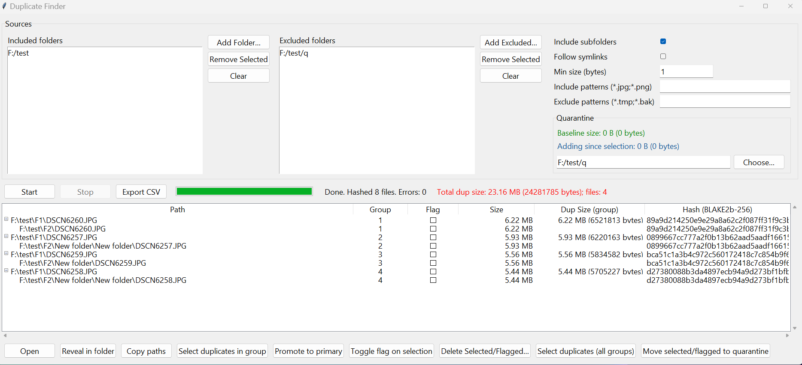

# Duplicate Finder (Tkinter, Python 3.10+)

A Tkinter-based GUI **Python script** for locating and managing duplicate files. It scans one or more directories, groups identical files by cryptographic hash, and provides tools to review, move to a quarantine folder, or delete duplicates.



---

## Overview

- **Technology**: Python standard library only; GUI built with Tkinter.
- **Platforms**: Windows, macOS, Linux.
- **Method**: Size → head+tail fingerprint (BLAKE2b-128) → full-file **BLAKE2b-256** on candidates, with up to 4 worker threads and 16 MB read chunks.


---

## Features

- Select multiple source folders (including drive roots).
- Optional recursion into subfolders; optional following of symlinks.
- Include / exclude filename patterns (e.g., `*.jpg;*.png`) and minimum size filter.
- **Excluded folders** list to omit subtrees under chosen sources.
- Determinate progress with file and byte counters.
- Results shown as a tree: one **original** file (oldest modification time) with **duplicate** children; **group numbers** shown.
- **Per-group “Dup Size (group)”** column and **click-to-sort** by duplicate bytes per group.
- **Total dup size** label (red), updating as you act on files.
- **Flag** column (checkboxes) in addition to standard row selection; press **Space** to toggle flags.
- **Select Duplicates in Group** and **Select Duplicates (All Groups)**. Originals aren’t selected by these actions.
- **Promote to Primary** (swap which file is shown as the group’s original; UI-only).
- **Quarantine** operations with collision-safe naming and cross-device fallback; **baseline** (green, size when chosen) and **added since selection** (blue) size meters.
- Export results as **CSV**.
- Results automatically stay consistent with the current source list.

---

## Requirements

- Python **3.10+** installed (this is a Python script, not a packaged executable).
- No third-party dependencies.

---

## Installation

```bash
git clone https://github.com/degenerator3003/DuplicateFinder.git
cd DuplicateFinder
```

---

## Running

```bash
python DuplicateFinderGUI.py
```

---

## Usage

1. **Add Sources**: Use **Add Folder…** to add directories to scan (multiple allowed).
2. **Options**:
   - **Include subfolders**, **Follow symlinks**, **Min size (bytes)**.
   - **Include / Exclude patterns**: semicolon-separated globs.
   - **Excluded folders**: omit subtrees from scanning.
   - **Quarantine folder**: destination for **Move to Quarantine**.
3. **Start**: Click **Start**. The application counts files, fingerprints candidates, then hashes them fully.
4. **Review Results**:
   - Parents are originals; children are duplicates.
   - **Sort** by “Dup Size (group)” to surface the largest groups.
   - Use the **Flag** column (Space toggles) or normal selection.
   - **Select Duplicates in Group** or **Select Duplicates (All Groups)** to target only duplicates.
5. **Actions**:
   - **Open** / **Reveal in Folder** / **Copy Paths**.
   - **Move to Quarantine**: safe across devices; name collisions get numeric suffixes. The **green** meter shows the baseline size at selection; the **blue** meter shows bytes added since selection.
   - **Delete Selected/Flagged…**: permanently deletes (no system recycle bin).
   - **Export CSV**: includes group context and per-group duplicate size.

---

## How It Works

1. **Enumeration**: Walk selected roots; apply include/exclude filters; avoid reprocessing the same inode (hard links).
2. **Size bucketing**: Only files with the same size proceed.
3. **Fingerprint + Hash**: Head+tail **BLAKE2b-128** fingerprint; if still colliding, full **BLAKE2b-256** over entire file (16 MB read chunks; up to 4 workers).
4. **Grouping**: Files with identical `(size, digest)` are duplicates; the original is the file with the oldest modification time.

The scanner runs in a background thread. UI updates are posted via a queue; cancellation is handled by a thread event.

---

## Notes

- Delete uses `os.remove()` (no system recycle bin).
- Hashing reads full file content for candidates; large datasets can take time.
- Network/removable storage may be slower and trigger permission errors.
- Following symlinks can lead to repeated content via multiple entry points; disable if not desired.
